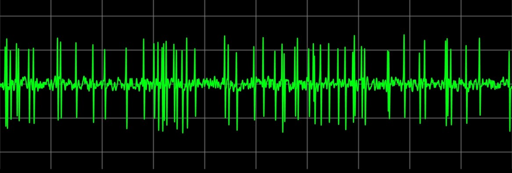

After finishing my PhD, I moved to Australia and worked in the department of Physiology at Monash University. My role was to co-develop virtual experiments with different faculty members that serve five key outcomes:

- Familiarize students with the specifics of the experimental setup and data collection that they simulate. This has resulted in more efficient “wet lab” practical classes, allowing for more efficient data collection and more time to fully explore the experimental process, and engage in data analysis and interpretation. 

- Allow students to perform experiments that are impossible in a traditional classroom, such as the effects of aging or disease, or the effects of expensive or controlled substances. 

- Reduce the number of animals used in the practical classes, which addresses both growing student concern into the use of animals for teaching and the time spent by staff preparing surgical procedures, tissues, etc. 

- Bridge gaps in knowledge necessary to carry out the wet lab class, such as how to evaluate and enter data collected for analysis, or remind the student of the anatomy or physiology of the system to be studied. 

- Every student is fully involved in all aspects of each simulation, and we randomize the data so that no two students get identical data. This stands in contrast to the limitations introduced by the use of expensive equipment, where large student groups perform an experiment with only a few of them actively involved in the process, and no variability in the data.

---

These experiments are openly available to educators around the world to use in their teaching, below is a description of the main experiments I programmed.

[Action potentials](https://ilearn.med.monash.edu.au/physiology/action-potentials/index.html): Uses a mathematical model of a spiking neuron to explore several aspects of action potentials. Developed by myself, under the supervision of Prof. Ramesh Rajan.

[Auditory spatial tuning](https://ilearn.med.monash.edu.au/physiology/indiv/neurophysiology/auditory.html): Simulates an electrophysiological recording from a spatially tuned neuron in auditory cortex. Developed in collaboration with Prof. Ramesh Rajan.

[Cardiovascular experiments](https://ilearn.med.monash.edu.au/physiology/cardiovascular/index.html): Simulates the measurement of mean arterial pressure, heart rate, cardiac output, stroke volume and total peripheral resistance while performing three different interventions: postural change, cold pressor, and mental stress tests. Developed in collaboration with Prof. Katherine Denton and Dr. Joanne Caldwell Odgers.

[Gastrointestinal smooth muscle](https://ilearn.med.monash.edu.au/physiology/gastro-smooth-muscle/index.html): Simulates measuring the amplitude of the contractions in a short section of rabbit ileum together with its extrinsic nerve supply; by stimulating the peripheral nerves as well as applying noradrenaline and acetylcholine to the bath, with or without phentolamine and atropine present in the bath. Developed in collaboration with Assoc. Prof. Julia Choate.

[Male reproduction](https://ilearn.med.monash.edu.au/physiology/MaleReproduction/index.html): Investigates the effects of various treatments on male reproductive function. Developed in collaboration with Assoc. Prof. Renea Taylor.

[Obesity](https://ilearn.med.monash.edu.au/physiology/Obesity/index.html): Investigates metabolic function in control and obese mice. Developed in collaboration with Dr. Belinda Henry.

[Tactile sense](https://ilearn.med.monash.edu.au/physiology/Neurophysiology/tactile.html): Simulates an electrophysiological recording of neural activity from Aβ nerve fibers with skin receptors on the hand. Developed in collaboration with Prof. Ramesh Rajan.

[Visual neuroscience](https://ilearn.med.monash.edu.au/physiology/indiv/neurophysiology/visual.html): Simulates an electrophysiological recording of a typical neuron in MT, and explores how the response depends on motion direction, contrast, and some other unrevealed factors. Developed in collaboration with Assoc. Prof. Nic Price. This experiment is licensed Creative Commons, source code can be found [here](https://github.com/virtual-laboratories/visual-neuroscience).
